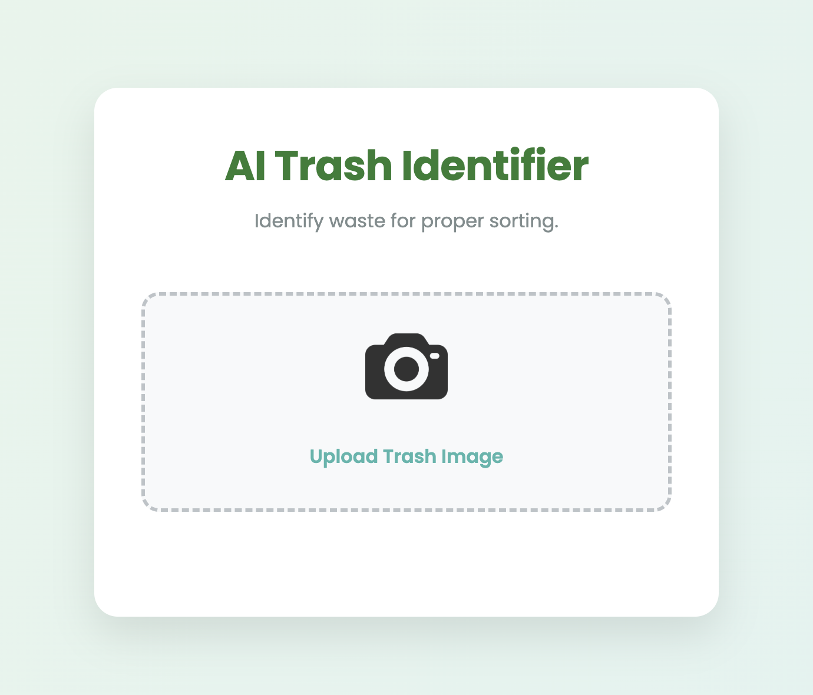
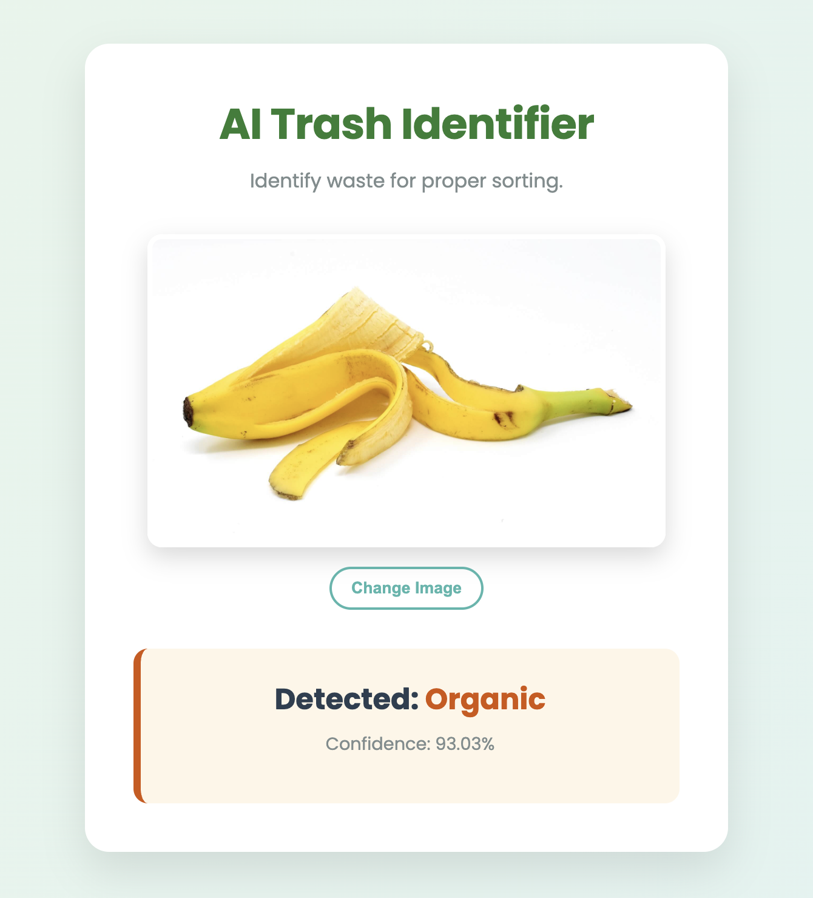
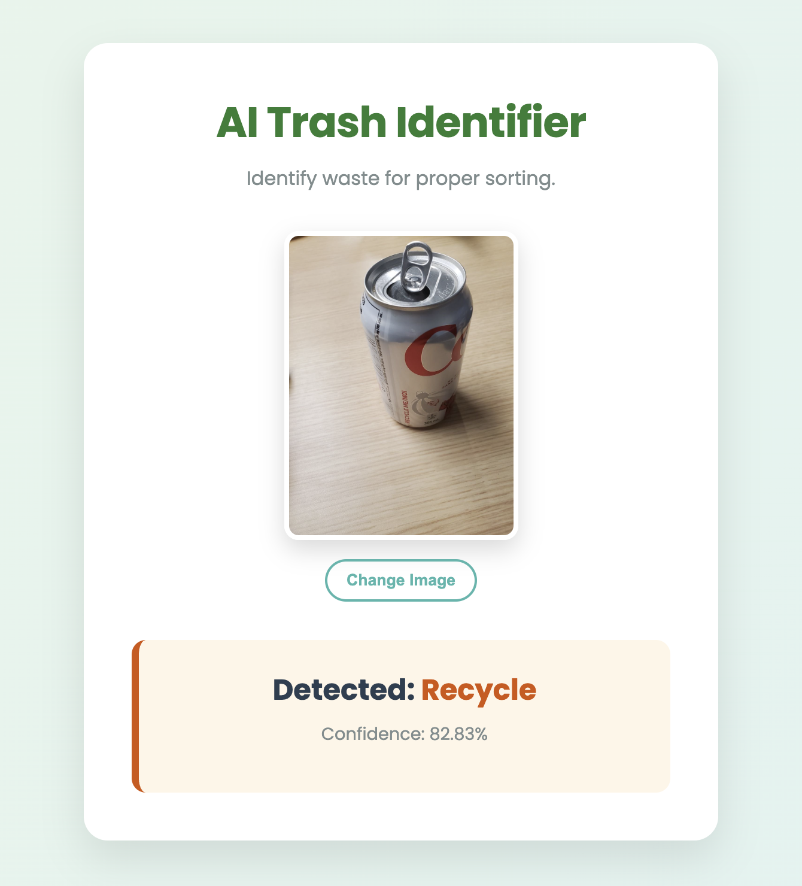

# AI Trash Identifier 🗑️

An AI-powered web application that classifies waste images as **Organic** or **Recyclable** using Deep Learning.  
Built with **TensorFlow** and **Flask**, featuring a modern UI and real-time predictions, and optimized for **Apple Silicon (M-series)** chips.

---

## 🚀 Features

- **AI-Based Waste Classification**  
  Custom-built **Convolutional Neural Network (CNN)** trained on 25,000+ images to classify trash into *Organic* or *Recyclable* categories.
- **Real-Time Predictions**  
  Images are processed asynchronously using AJAX, no page reloads.
- **Apple Silicon Optimized**  
  Training pipeline leverages `tensorflow-macos` and `tensorflow-metal` for GPU acceleration on M1/M2/M3/M4 chips.
- **Clean & Responsive UI**  
  Single-page interface with image preview, loading animation, and confidence score.
- **End-to-End ML Pipeline**  
  Dataset preprocessing → model training → deployment → browser-based inference.

---

## 📸 Demo

| Home Screen | Organic Result | Recyclable Result |
|:---:|:---:|:---:|
|  |  |  |

---

## 🧠 How It Works

1. User uploads a trash image via the web interface  
2. Image is resized and normalized  
3. The CNN model performs inference  
4. Prediction and confidence score are returned instantly  

---

## 🛠️ Tech Stack

- **Backend:** Python, Flask
- **AI/ML:** TensorFlow, Keras, NumPy, SciPy
- **Frontend:** HTML5, CSS3, JavaScript (Fetch API)
- **Image Processing:** Pillow (PIL)

---

## 🎯 Use Cases

- Smart waste sorting systems
- Recycling awareness applications
- Computer vision learning projects
- Sustainability-focused AI demos

---

## 📊 Model Architecture

- **Input:** 150 × 150 RGB images
- **Convolutional Layers:** 3 layers (32 → 64 → 128 filters)
- **Pooling:** MaxPooling after each convolution
- **Fully Connected Layer:** Dense layer with 512 units
- **Regularization:** Dropout (0.5)
- **Output Layer:** Sigmoid activation for binary classification

**Loss Function:** Binary Cross-Entropy  
**Optimizer:** Adam (Apple Silicon optimized)

---

## 📦 How to Run

### 1. Clone the Repository
```bash
git clone https://github.com/arikahnaf/ai-trash-identifier.git
cd ai-trash-identifier
```

### 2. Create a Virtual Environment
```bash
python3 -m venv venv
source venv/bin/activate
```

### 3. Install Dependencies
```bash
pip install -r requirements.txt
```

> ⚠️ **Platform Compatibility**  
> This project is optimized for **Apple Silicon (M-series)** chips using `tensorflow-macos` and `tensorflow-metal`.     
> If you are on **Windows, Linux, or an Intel-based Mac**, replace these packages with the standard `tensorflow` library in `requirements.txt`.

### 4. Train the Model
```bash
python train_model.py
```

### 5. Run the Application
```bash
python app.py
```
Open your browser and navigate to:  
[http://127.0.0.1:5001](http://127.0.0.1:5001)

---

## 📁 Project Structure

```
ai-trash-identifier/
├── app.py                  # Flask backend & inference API
├── train_model.py          # CNN training script
├── model.h5                # Trained model (not included due to size)
├── requirements.txt        # Dependencies
├── static/                 # CSS, icons
├── templates/
│   └── index.html          # Frontend UI
├── screenshots/            # Demo screenshots
└── dataset/                # Training data (not included due to size)
```

---

## 📚 Dataset

The model was trained using a labeled waste image dataset from Kaggle:

🔗 **Kaggle Dataset:**  
https://www.kaggle.com/datasets/techsash/waste-classification-data

### Dataset Details
- **Classes:** Organic and Recyclable
- **Size:** Over 25,000 images
- **Data Augmentation Techniques:**
  - Rotation
  - Zoom
  - Horizontal flipping
  - Translation

⚠️ The dataset is **not included** in this repository due to size constraints.

---

## 🚀 Future Improvements

- Multi-class classification (plastic, glass, metal, paper)
- Mobile camera integration
- Transfer learning (MobileNet / ResNet)
- Cloud deployment (Docker, Render, AWS)